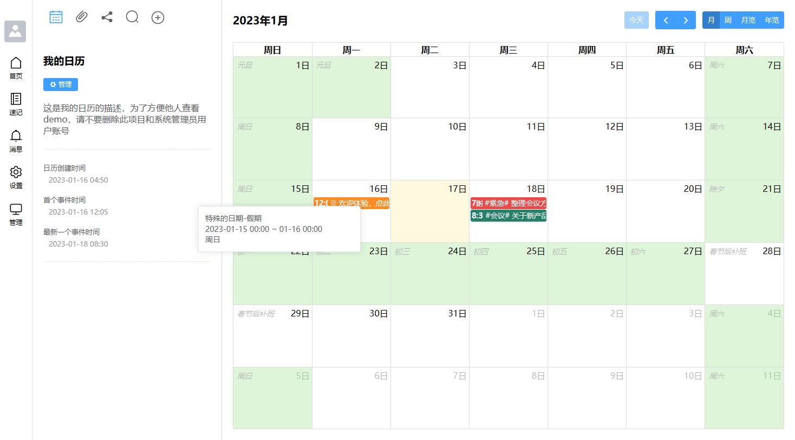
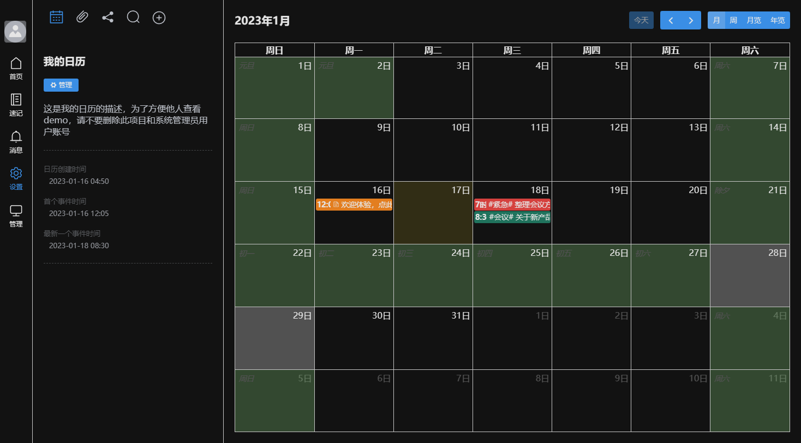
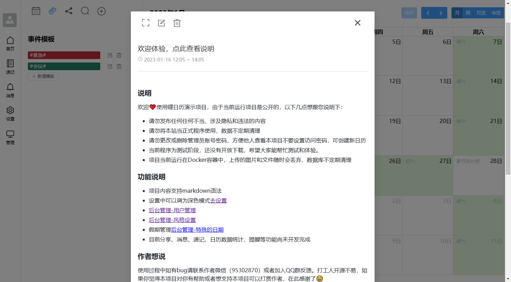

<p align="center">

<br>
Li Calendar - 锂日历记事本
<br>
<a title="Github" target="_blank" href="https://github.com/li-calendar-notepad">Github</a> |
<a title="Gitee" target="_blank" href="https://gitee.com/li-calendar-notepad">Gitee</a> 
</p>


## 🛸 介绍

前身[日历记事本PHP版本](https://gitee.com/hslr/calendar_notepad)，因为工作中常常要记录每天的工作日志，所以2020年上半年，抽了几天的下班时间开发了PHP版本，稳定运行了一年，但是它有些不足，2021年决定重新启动此项目，对他进行优化和增加功能并进行了技术升级。后期接触了GO+Gin+Vue3并再次重新开发了本项目 锂日历记事本。

## 🎁 软件架构

|名称|说明|
|---|---|
|Go|程序的后端语言|
|Gin|后端框架|
|Gorm|ORM数据库框架|
|vue3|前端框架|
|ElementUI-Plus|前端ui框架|
|fullcalendar|日历视图框架|


## 🌱 相对PHP版本增加以及准备做的
- [x] 全新UI
- [x] 内容选用高级编辑器支持传文件，粘贴图片
- [x] 深色模式支持
- [x] 强化事件模板功能，并支持拖拽
- [x] 风格支持自定义，支持导入导出
- [x] 节假日改为特殊日期，可导入。后期可根据用户提供支持其他地区或国家假期
- [x] docker运行
- [x] 设置邮件提醒 (**请注意:docker运行需要证书**)
- [ ] 按时间范围，分享日历视图
- [ ] 速记功能
- [ ] 事件时间线视图
- [ ] 单事件收藏、分享
- [ ] 项目的收藏功能
- [ ] 时间线视图


## ⌨️ 前端源码
项目进行了前后端分离，所以本源码不包含前端，前端是由`Vue3`+`Element-UI Plus`+`Fullcalendar`，前端项目源码请访问：[github](https://github.com/li-calendar-notepad/li-calendar-vue) | [gitee](https://gitee.com/li-calendar-notepad/li-calendar-vue)

## 🚥 说明
目前项目仍处于开发阶段，部分功能未完善，欢迎体验，有问题可以提Issues，暂时不建议作为正式项目使用。

## 🖼️ 截图

日历首页


深色模式


事件内容


事件模板


## 💾 编译

#### 方式一 （通用）

1. 前端文件编译后，将dist下文件全部移植`./assets/frontend`文件夹下。编译教程请参考[前端项目](#前端源码)的`readme.md`文件

2. 按照[此教程](./assets/readme.md)安装工具。然后将
    `assets`文件夹编译成go文件（目的是把静态资源打包在可执行文件内）
3. 依次执行
    ```shell
    # 编译静态资源（上一步执行完成了，可以不用重复执行）
    go-bindata-assetfs -o=assets/bindata.go -pkg=assets assets/... 
    
    # 开始编译，编译成功后在项目根目录生成可执行文件：li-calendar win平台: li-calendar.exe
    go build -o li-calendar main.go
    ```
#### 方式二 （Docker）推荐此方式

前提：docker环境，并且可以执行make命令，暂时不适用于windows平台

1. 将前端代码克隆在当前项目的根目录并将文件夹命名为`web`
    示例：
    ```shell
    # github
    git clone https://github.com/li-calendar-notepad/li-calendar-vue web
    
    # gitee
    git clone https://gitee.com/li-calendar-notepad/li-calendar-vue web
    ```
2. 执行make命令
    ```shell
    # 编译程序，成功后项目根目录会生成压缩包
    make build
    ```

## 🚄 运行

#### 生成配置文件：
```
# 生成配置文件（必须）
./li-calendar config

# 执行完成之后同级目录会生成`conf`目录，里面有两个配置文件，根据自己的需求修改`config.ini`文件内容
```

#### 可执行文件运行：

首先下载好对应系统的可运行文件，如果没有你所使用系统的文件，请自行编译或者使用docker ，下载地址：[gitee](https://gitee.com/li-calendar-notepad/li-calendar-gin/releases) | [github](https://github.com/li-calendar-notepad/li-calendar-gin/releases)

```
# linux
./li-calendar 

# windows (避免出错请使用 cmd 运行)
.\li-calendar.exe
```


## 💎 docker 和 docker-compose 运行

[docker 仓库](https://hub.docker.com/r/hslr/li-calendar)

如果使用 docker-compose 请[点此查看 docker-compose.yml](./docker-compose.yml)

**请将前端项目拉取到当前目录，并将前端项目命名为`web`，否则无法编译成功**

```shell
# 拉取镜像
docker pull hslr/li-calendar:latest

# 创建挂载文件夹
mkdir -p ~/docker_data/li-calendar/{conf,uploads,database}

# 运行
docker run --name li-calendar -p 9090:9090 \
-v ~/docker_data/li-calendar/conf:/app/conf \
-v ~/docker_data/li-calendar/uploads:/app/uploads \
-v ~/docker_data/li-calendar/database:/app/database \
hslr/li-calendar:latest
```

更多参数说明
```sh
# 环境变量
-e TZ=Asia/Shanghai # 设置中国上海时区（避免错过邮件提醒）

# 数据挂载（根据需求选择）
-v ~/docker_data/li-calendar/conf:/app/conf # 项目配置目录
-v ~/docker_data/li-calendar/uploads:/app/uploads # 上传的文件目录
-v ~/docker_data/li-calendar/runtime:/app/runtime # 运行缓存、日志等
-v ~/docker_data/li-calendar/lang:/app/lang # 语言文件目录
-v ~/docker_data/li-calendar/database:/app/database # sqlite数据库目录
```


## 🧂 访问、默认账号密码：

### 浏览器打开

```
http://[你的域名或ip]:9090
```

### 默认账号密码

```
账号：admin2024  // 年份是根据当时部署的年份创建的
密码：123456
```


## ⛺ (假日、风格)导入文件
特殊日期和风格文件下载（特殊日期包含中国法定节假日2020-2023年文件，欢迎提供其他地区或者国家假期数据）
[去查看和下载，持续更新](https://cloud.enianteam.com/#/share/ugwzotae)

## 🎁 打赏

开源不易，如果你喜欢本项目或者觉得项目对你有帮助，欢迎进行[🧧打赏作者🧧](https://blog.enianteam.com/u/sun/content/11#%E6%89%93%E8%B5%8F)。记得加作者留名。在此感谢

## 😎 代码贡献

感谢各位爱好者对本项目作出的贡献（按加入时间排序）：

- 红烧猎人 \[ [Github](https://github.com/hslr-s) | [Gitee](https://gitee.com/GgoCoder) ]

- GgoCoder \[ [Github](https://github.com/forgocode) | [Gitee](https://gitee.com/GgoCoder) ]